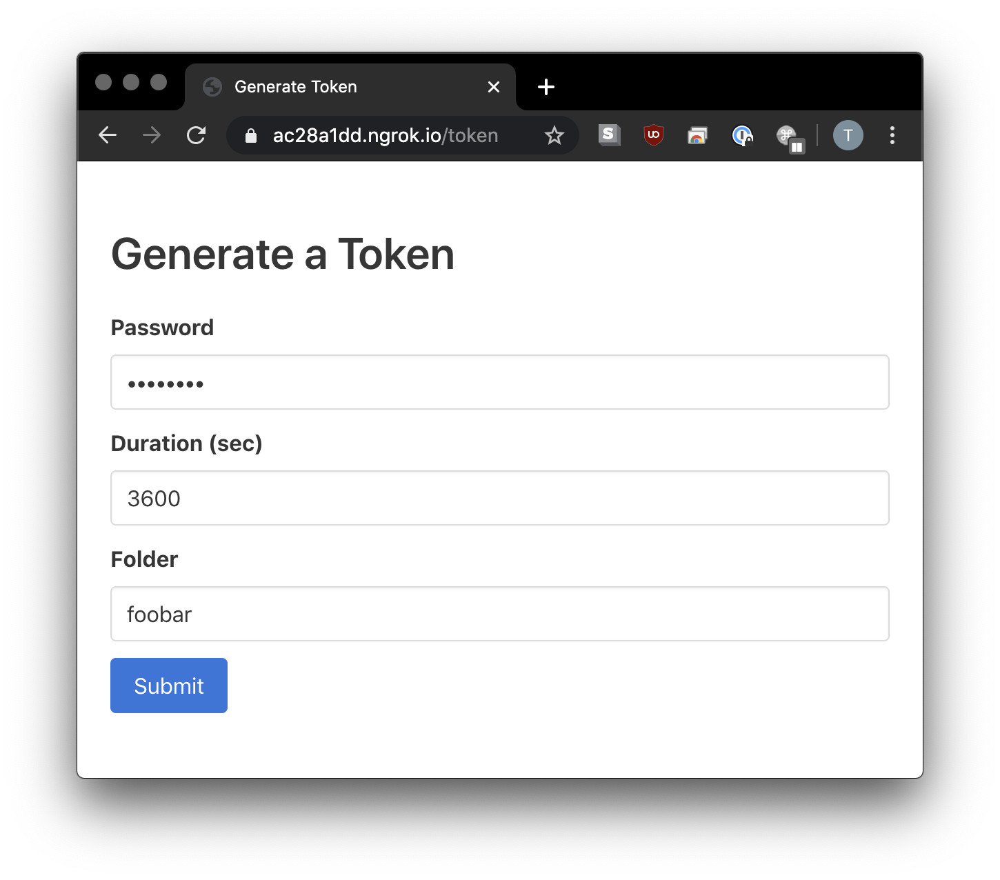
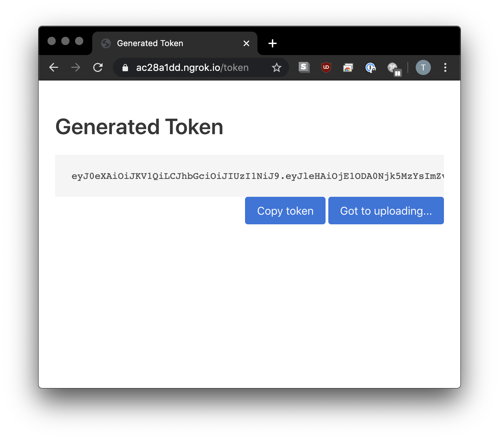
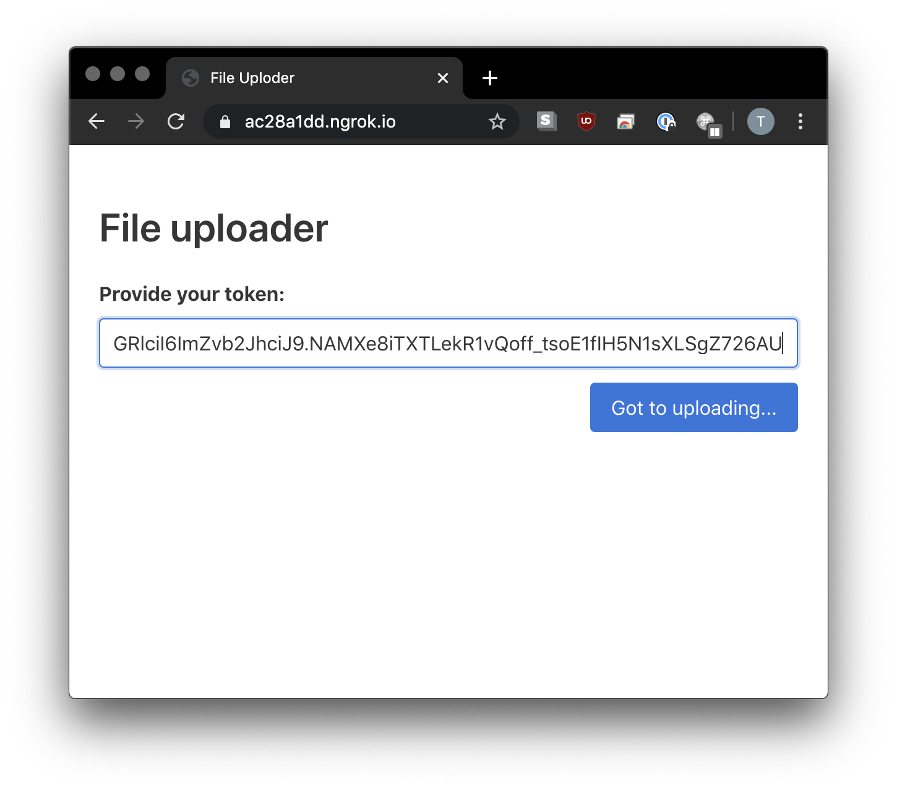
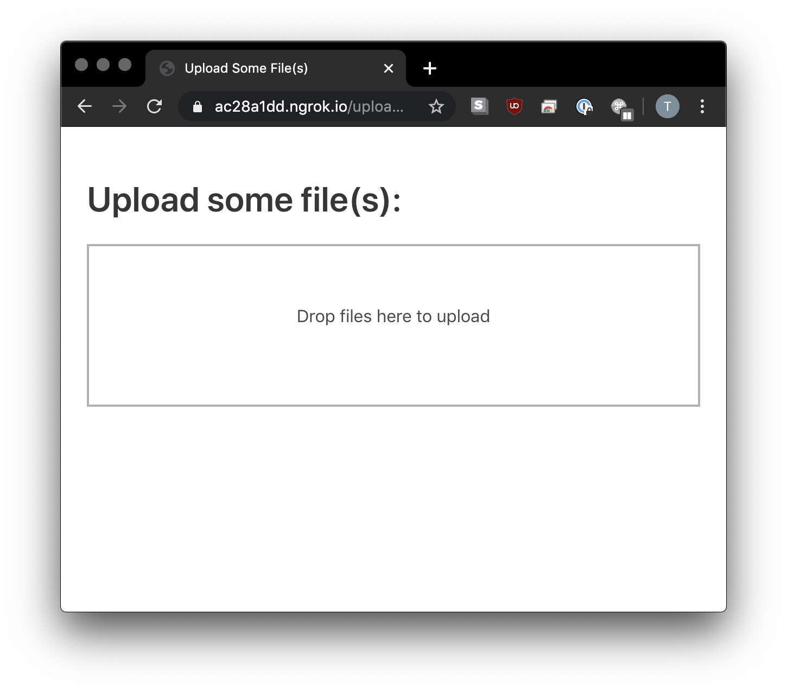
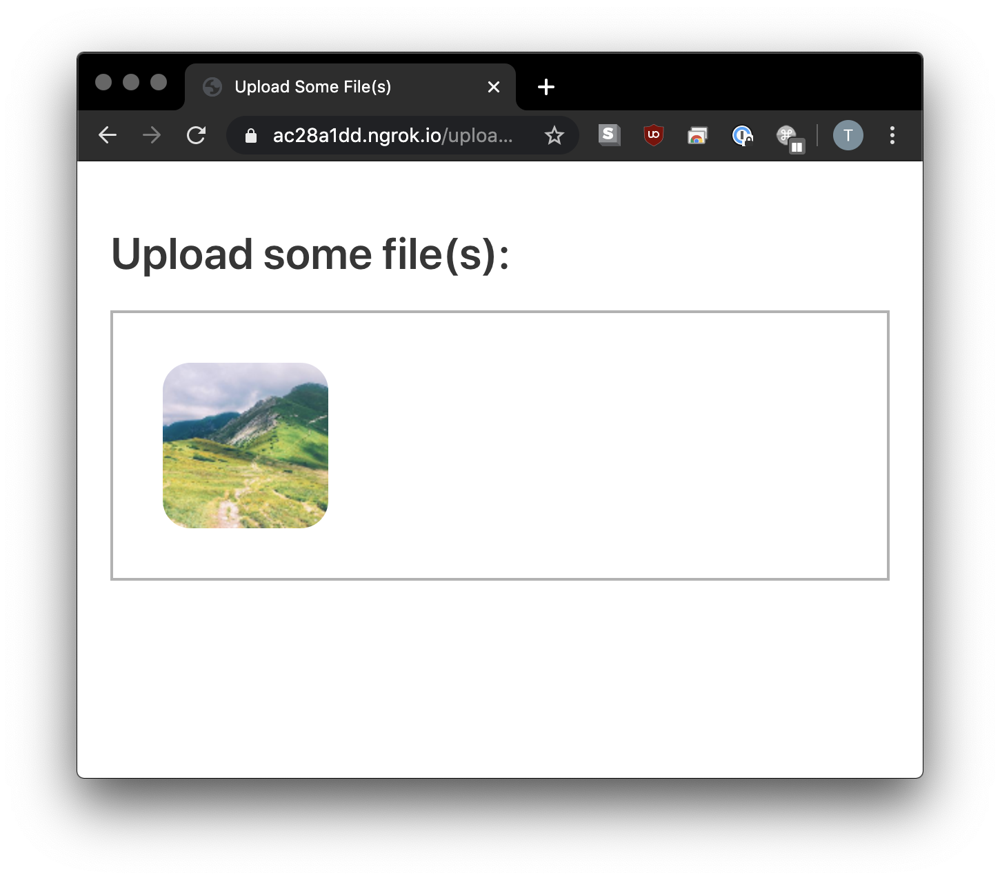
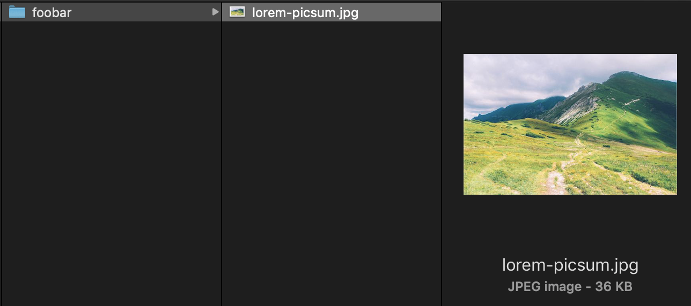

# uploader

Take control of files send to you. Start a web-server, provide (JWT) tokens for
authorized uploaders, store uploaded files locally, on GCS, ... .

As admin, create a new token by:

- going to `/token`
- providing your admin secret
- specifying the time for the token to be valid, e.g. 3600 sec is one hour
- specifying the subfolder uploads will be stored in



You will be redirected to the token page - you can either copy the token or go directly to the upload page:



**This is the token you provide to users.** It will be valid for the specified time only and all uploads will be put into the specified subfolder.

As a user, you will get the token and go to the root path `/`:



When clicking `Go to uploading...`, you will be directed to the uploading page:



(You can also give away the upload url with the token in the query path: `/upload?token=GRIcil....` and create a shortcut url with some url shortener, e.g. `bitly.com`.)

The drag and drop interface used is [dropzonejs](https://www.dropzonejs.com/). Drag and drop and file selection should both work as expected:



Afterwards the file(s) should be in the specified folder:



## Configuration

The service is configured via environment variables.

- `UPLDR_JWT_SECRET`: Some random string used for signing the JWT secret.
- `UPLDR_ADMIN_SECRET`: When creating a token for uploading, the admin will need the password specified here.
- `UPLDR_LOCAL_PATH`: A path to a local folder. Uploads will be stored here.
- `UPLDR_GCS_PATH`: A google cloud storage path (i.e. `gs://bucket-name/path/to/some/folder`). Uploads will be stored here.

**Note**: Only set one of the following environment variables:

- `UPLDR_LOCAL_PATH`
- `UPLDR_GCS_PATH`

## Start the web-server

With docker:

```sh
» docker run -it --rm --name uploader -p 127.0.0.1:8000:80 \
             -e UPLDR_JWT_SECRET \
             -e UPLDR_ADMIN_SECRET \
             -e UPLDR_LOCAL_PATH \
             -e UPLDR_GCS_PATH \
             tammoippen/uploader:latest
```

For development, you first have to install the dependencies:

```sh
» git clone https://github.com/tammoippen/uploader.git
» cd uploader
» poetry install
# if you want to use GCS, install with `-E gcs`
» poetry install -E gcs
» poetry shell
# set your environment variables for configuration
# start the service
» uvicorn uploader:app --reload
```

## Store to a local folder

Start the service with docker:

```sh
docker run -it --rm --name uploader -p 127.0.0.1:8000:80 \
           -e UPLDR_JWT_SECRET=some-random-data \
           -e UPLDR_ADMIN_SECRET=your-password-for-creating-tokens \
           -e UPLDR_LOCAL_PATH=/path/to/your/upload/folder \
           tammoippen/uploader:latest
```

Use [ngrok.com](https://ngrok.com/) to create a temprary url for accessing the locally running
`uploader` service:

```sh
» ngrok http 8000
```

You get a url like `https://ac28a1dd.ngrok.io` to connect to your service.

## Store to GCS folder

Set the environment variable `UPLDR_GCS_PATH` to a GCS path you have access to. Make sure your service
does have access to the bucket as well (see [GC Authentication](https://cloud.google.com/docs/authentication/)).
Then start the web-service accordingly.

## Thanks to

- [dropzone js](https://dropzonejs.com) for the drag and drop interface.
- [pyjwt](https://github.com/jpadilla/pyjwt) for the jwt implementation.
- [fastapi](https://github.com/tiangolo/fastapi) and dependencies for the webserver.
